# Chat do Hire — versão 1 × versão 2

- **Versão 1** — tag [`chat-v1`](https://github.com/LukasLuut/Hire-2.0/tree/chat-v1): cada negociação era uma conversa; depois do contrato a conversa ficava só leitura.
- **Versão 2** — branch `feat/tcc-conformidade`: uma conversa por par cliente ↔ prestador, que nunca fecha, com as negociações dentro dela.

## O que mudou

| | Versão 1 | Versão 2 |
| --- | --- | --- |
| Conversas | uma por negociação (a mesma pessoa em várias linhas) | uma por pessoa; negociações dentro |
| Depois do contrato | conversa bloqueada | campos da negociação limpos, conversa continua |
| Criar negociação | só pedido de orçamento do cliente | serviço do catálogo (os dois), proposta sob medida (prestador, pode ir para o catálogo), pedido (cliente) |
| Negociação longa | aviso de não lida só no navegador | não lidas no servidor, "Aguardando você" no painel e na sala |
| Lista de conversas | sem busca; 1 consulta por conversa | busca, filtros (Todas, Não lidas, Negociando), paginação, poucas consultas |
| Salas | modal + página `/negotiation/:id` (duas implementações) | uma sala só; `/negotiation/:id` abre a sala |
| Marcos | mensagens de texto | cards (proposta, contrato, recusa) e linhas de atividade (aceites) |
| Limites | nenhum no servidor | 2.000 caracteres e 30 mensagens/min |

## Painel de conversas

| Versão 1 | Versão 2 |
| --- | --- |
| 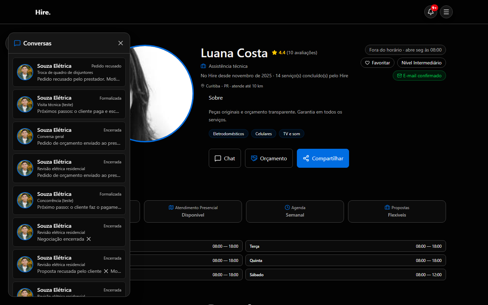 | 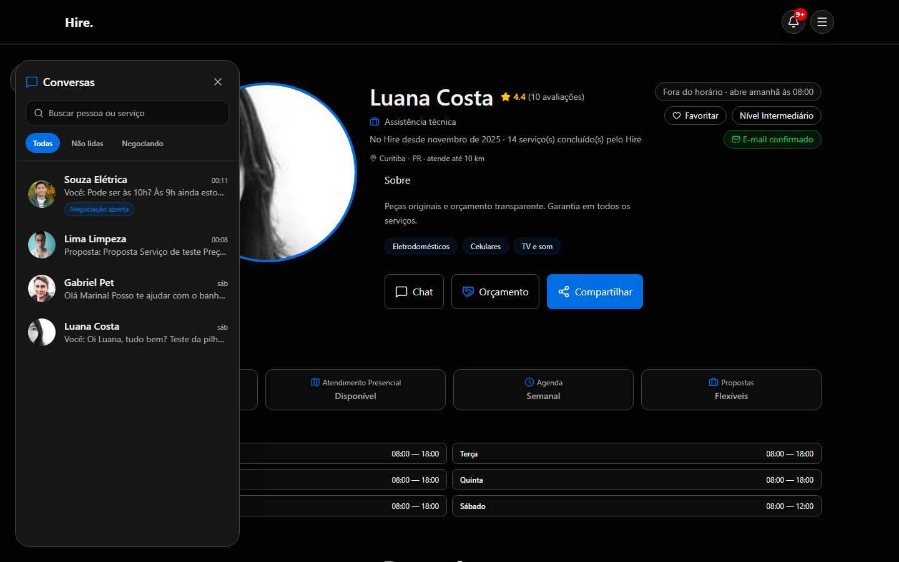 |

## Sala

| Versão 1 | Versão 2 |
| --- | --- |
| 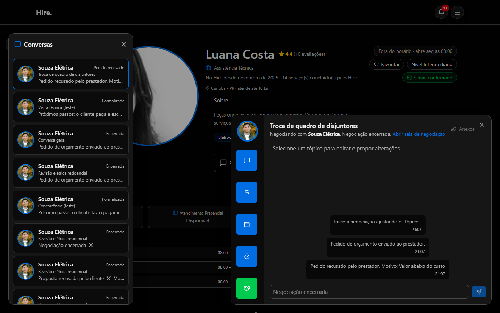 | 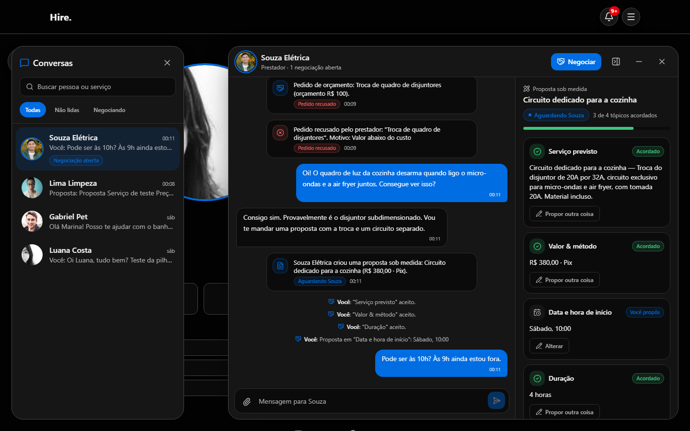 |

Visão do prestador (a mesma negociação esperando por ele) e tema claro:

| Prestador | Tema claro |
| --- | --- |
| 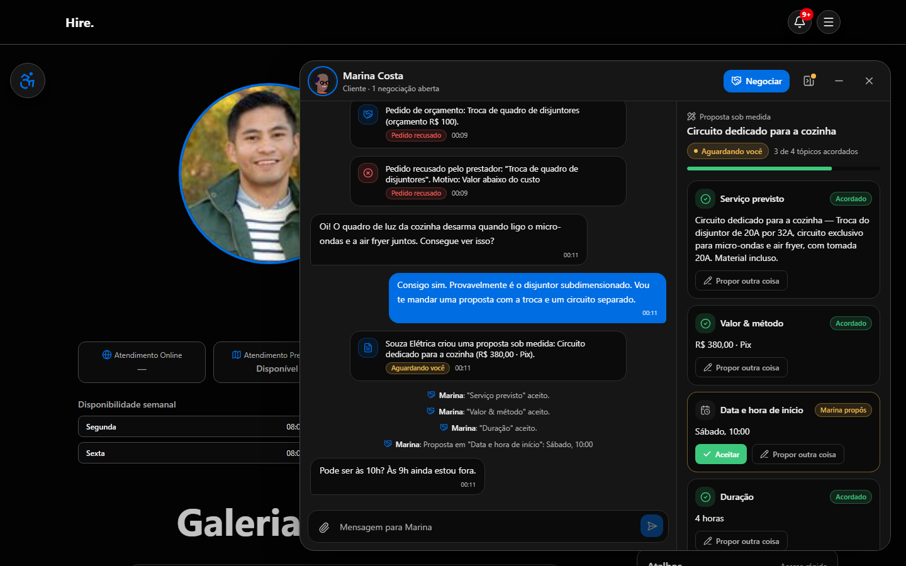 | 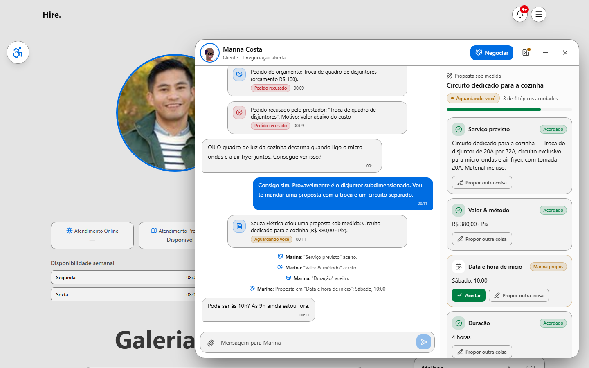 |

## Negociar dentro da conversa

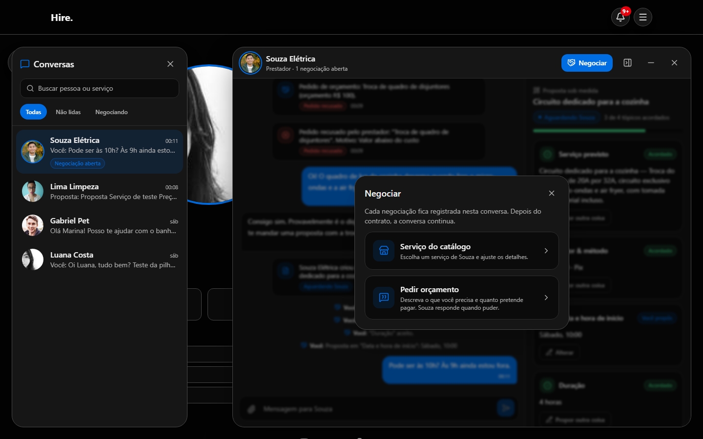

## Do acordo ao contrato — e a conversa continua

| Prestador aceitou | Acordo fechado | Conversa continua |
| --- | --- | --- |
| 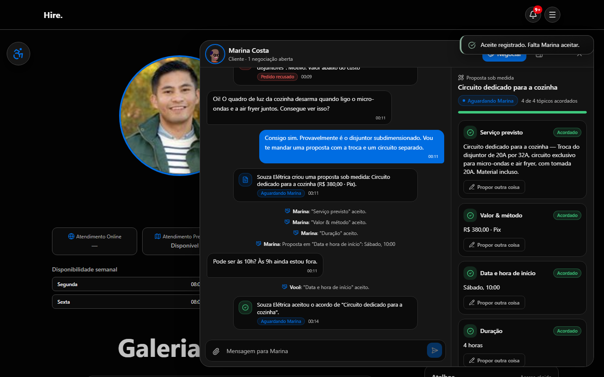 | 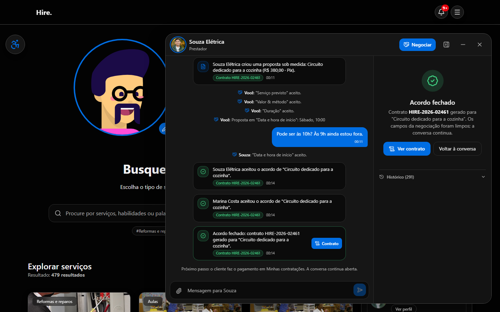 | 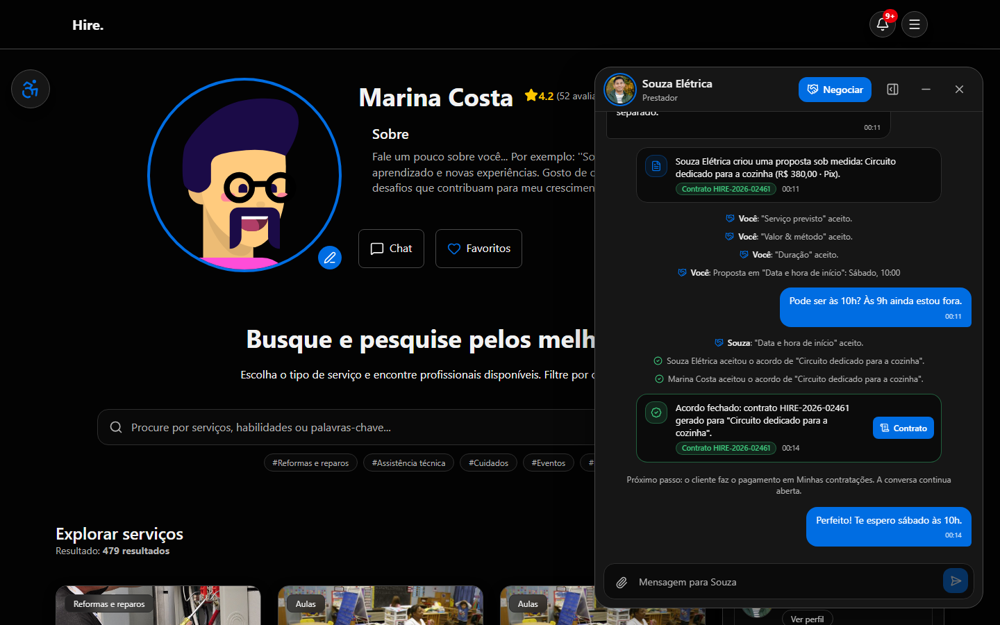 |

## Minimizadas

| Versão 1 | Versão 2 |
| --- | --- |
| 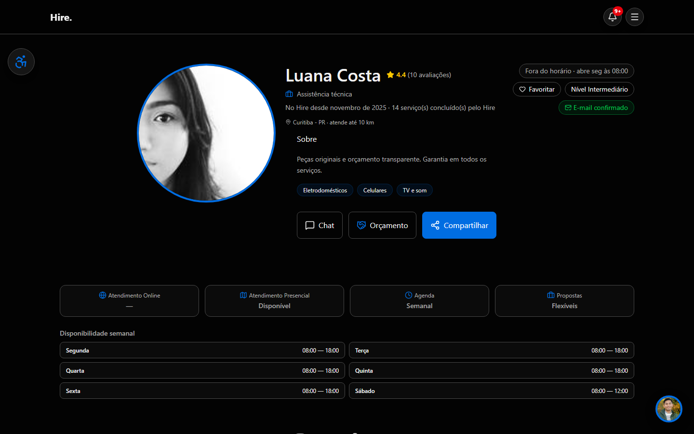 |  |

## Celular

| Versão 1 — sala | Versão 2 — painel | Versão 2 — sala | Versão 2 — negociação |
| --- | --- | --- | --- |
| 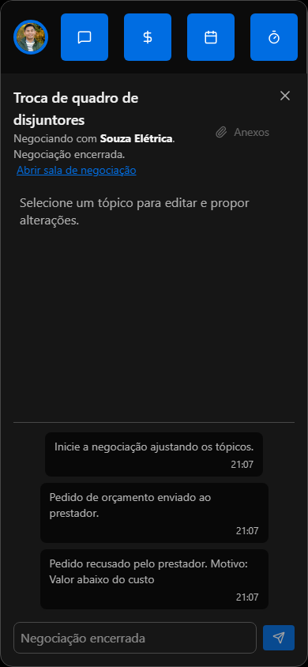 |  | 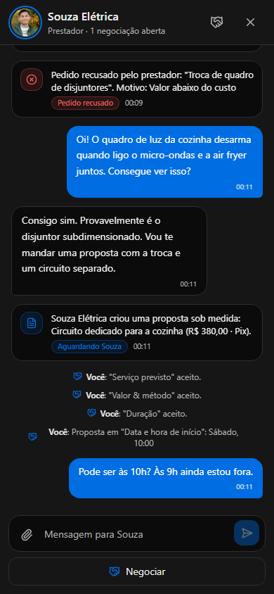 | 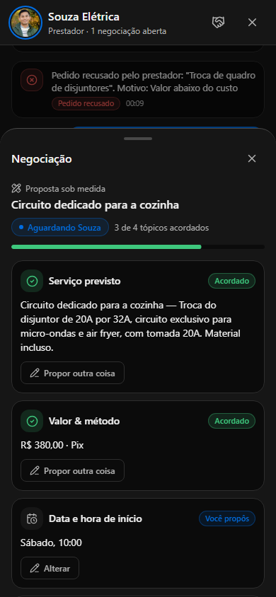 |

## Movimento

Durações de 140 a 280 ms, curva `cubic-bezier(0.22, 1, 0.36, 1)` (entra desacelerando), só `transform` e `opacity` nas animações frequentes. Respeita "reduzir movimento" do sistema (`MotionConfig reducedMotion="user"`).
